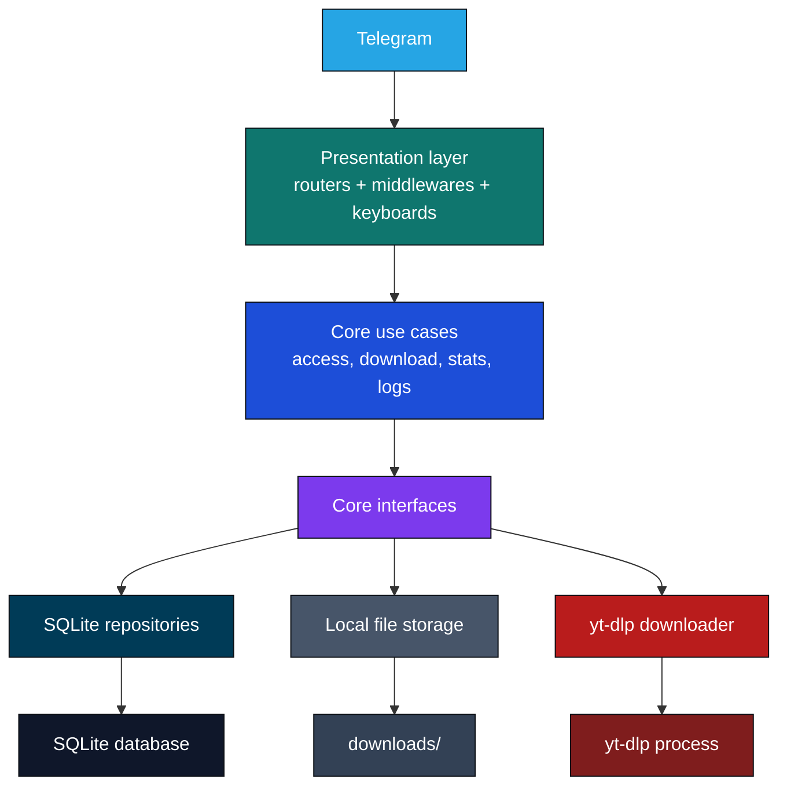

<div align="center">

<p>
  
</p>

[](https://www.python.org/downloads/)
[](https://telegram.org/)
[](https://docs.aiogram.dev/)
[](https://github.com/yt-dlp/yt-dlp)
[](https://www.sqlite.org/)
[](https://www.docker.com/)
[](https://pytest.org/)
[](https://learn.microsoft.com/powershell/)

<p>
  <a href="README.ru.md"><strong>Русская версия</strong></a>
</p>

</div>

TTsavebot is a Telegram bot for downloading media from supported TikTok and Instagram links with a stricter operational model than a throwaway utility bot. It checks access through a whitelist, separates admin-only flows, returns the downloaded video back to Telegram, and records usage history in SQLite so the bot remains manageable when used by a controlled group rather than the public internet.

## ✨ Features

| Area | What is implemented | Status |
| --- | --- | --- |
| Controlled access | Every incoming message goes through whitelist-based access checks |  |
| Supported media flow | Accepts TikTok links and Instagram Reel/Post links, downloads via `yt-dlp`, sends video back to user |  |
| Admin operations | `/panel`, `/allow`, `/deny`, `/stats`, `/logs` plus inline admin callbacks |  |
| Logging and stats | Stores download attempts, failures, rejections, oversize events, and aggregate stats in SQLite |  |
| Local file hygiene | Creates runtime directories, deletes stale temp files, removes sent files after delivery |  |
| Test coverage | Unit and integration tests for config, URL validation, use cases, repositories, handlers, and middleware |  |

## 🎯 Why This Project

- Most Telegram download bots are written as a single runtime script. This repository is intentionally structured into presentation, core, and infrastructure layers so access rules, download logic, and persistence stay easy to reason about.
- The bot is designed for controlled usage, not anonymous public traffic. That makes whitelist management, admin commands, and operational visibility first-class concerns instead of afterthoughts.
- SQLite logging and simple Docker packaging make it practical for small private deployments where you want traceability without turning the bot into a large service platform.

## 🔄 Supported Workflow

| Step | Behavior |
| --- | --- |
| 1. Access check | The bot verifies that the Telegram user is active in the whitelist |
| 2. Link validation | Only TikTok and Instagram Reel/Post URLs are accepted |
| 3. Download | `yt-dlp` downloads the media into a temporary request folder |
| 4. Delivery | The bot sends the resulting video file back to Telegram |
| 5. Cleanup and logging | Temp files are removed and the result is written to SQLite |

<details>
<summary><strong>Supported links</strong></summary>

| Platform | Accepted forms |
| --- | --- |
| TikTok | `tiktok.com/...`, `*.tiktok.com/...`, including short-host variants such as `vm.tiktok.com` |
| Instagram | `instagram.com/reel/...` and `instagram.com/p/...` |

</details>

## 🧭 User Flow

```mermaid
flowchart LR
    U["User sends supported link"] --> A["Auth middleware"]
    A -->|Allowed| D["Download handler"]
    A -->|Rejected| R["Reject request and write log"]
    D --> V["Validate platform and URL"]
    V --> Y["yt-dlp downloader"]
    Y --> F["Temporary file in downloads/"]
    F --> T["Send video back to Telegram"]
    T --> L["Update SQLite log and cleanup file"]

    style U fill:#1f6feb,color:#fff,stroke:#0d1117
    style A fill:#0ea5e9,color:#fff,stroke:#0d1117
    style D fill:#10b981,color:#fff,stroke:#0d1117
    style R fill:#ef4444,color:#fff,stroke:#0d1117
    style V fill:#f59e0b,color:#111827,stroke:#0d1117
    style Y fill:#8b5cf6,color:#fff,stroke:#0d1117
    style F fill:#64748b,color:#fff,stroke:#0d1117
    style T fill:#22c55e,color:#fff,stroke:#0d1117
    style L fill:#334155,color:#fff,stroke:#0d1117
```



## 🏗️ Basic Architecture



## 💬 Commands

| Command | Access | Description |
| --- | --- | --- |
| `/start` | Whitelisted users | Intro message and current Telegram ID |
| `/help` | Whitelisted users | Lists commands available for the current role |
| `/whoami` | Whitelisted users | Shows current Telegram ID and role |
| `/panel` | Superadmins | Opens inline admin panel |
| `/allow <telegram_id>` | Superadmins | Adds a user to the whitelist |
| `/deny <telegram_id>` | Superadmins | Removes a user from the whitelist |
| `/stats` | Superadmins | Shows aggregate download statistics |
| `/logs` | Superadmins | Shows the latest download log entries |

## 🔐 Access Model

- Users are allowed only when they exist in the access repository and are marked active.
- `SUPERADMINS` from the environment are synchronized into the database on startup.
- Admin routes are guarded twice: general auth middleware checks whitelist access, and a dedicated superadmin middleware blocks privileged commands and callback actions.
- Rejected requests are still logged, which means unauthorized usage attempts remain visible in admin statistics and recent logs.

## 🗂️ Project Structure

```text
TTsavebot/
├─ main.py
├─ Dockerfile
├─ pyproject.toml
├─ .env.example
├─ tests/
│  ├─ unit/
│  └─ integration/
└─ video_bot/
   ├─ config.py
   ├─ containers.py
   ├─ core/
   │  ├─ entities/
   │  ├─ errors.py
   │  ├─ interfaces/
   │  └─ use_cases/
   ├─ infrastructure/
   │  ├─ database/
   │  ├─ downloaders/
   │  └─ storage/
   └─ presentation/
      ├─ handlers/
      ├─ keyboards/
      └─ middlewares/
```

## 🚀 Quick Start on Windows

### Prerequisites

- Python 3.11+
- Git
- PowerShell
- Optional but useful: FFmpeg installed on the machine for broader `yt-dlp` compatibility outside Docker

### Local run with `uv`

```powershell
git clone https://github.com/AmaLS367/TTsavebot.git
cd TTsavebot

py -m pip install uv
Copy-Item .env.example .env
notepad .env

uv sync --dev
uv run python .\main.py
```

> [!NOTE]
> The bot uses long polling. Once started, keep the process running in the current terminal session.

## 🐳 Docker

The repository already includes a production-oriented `Dockerfile`. It installs runtime dependencies, `uv`, and `ffmpeg`, then starts the bot with the project virtual environment inside the container.

```powershell
git clone https://github.com/AmaLS367/TTsavebot.git
cd TTsavebot

Copy-Item .env.example .env
notepad .env

docker build -t ttsavebot .
docker run --rm --env-file .env ttsavebot
```

## ⚙️ Configuration

| Variable | Required | Default | Purpose |
| --- | --- | --- | --- |
| `BOT_TOKEN` | Yes | None | Telegram bot token |
| `SUPERADMINS` | Yes | None | Comma-separated Telegram IDs that become superadmins on startup |
| `DB_PATH` | No | `data/bot.sqlite3` | SQLite database file path |
| `DOWNLOADS_DIR` | No | `downloads` | Temporary directory for downloaded media |
| `YTDLP_BIN` | No | `yt-dlp` | Explicit downloader command; falls back to `python -m yt_dlp` when available |
| `YTDLP_TIMEOUT_SECONDS` | No | `60` | Download timeout in seconds |
| `MAX_FILE_SIZE_MB` | No | `50` | Maximum file size allowed before Telegram delivery is rejected |
| `INSTAGRAM_COOKIES_PATH` | No | Empty | Optional `cookies.txt` path for content requiring authenticated access |
| `LOG_RETENTION_LIMIT` | No | `10000` | Maximum number of log rows to retain |
| `STALE_FILE_MAX_AGE_HOURS` | No | `24` | Age threshold for cleaning old temporary files |

## 🧪 Tests

The repository includes both unit and integration tests.

```powershell
uv sync --dev
uv run pytest
```

Useful targeted runs:

```powershell
uv run pytest .\tests\unit
uv run pytest .\tests\integration
```

Current test coverage includes:

- configuration loading
- supported URL validation
- download use case behavior
- middleware and handler behavior
- SQLite repository behavior

## 🛣️ Roadmap

- Expand automated test coverage around end-to-end bot flows.
- Add more operational documentation for deployment and maintenance scenarios.
- Improve admin observability around logs and audit-style inspection.
- Consider persistent bot state storage if the project grows beyond a single-instance runtime.

## 📄 License

This project is licensed under the GNU Affero General Public License v3.0. See [LICENSE](LICENSE).
